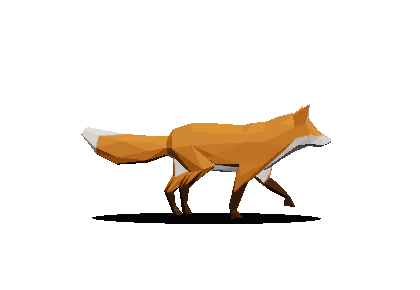
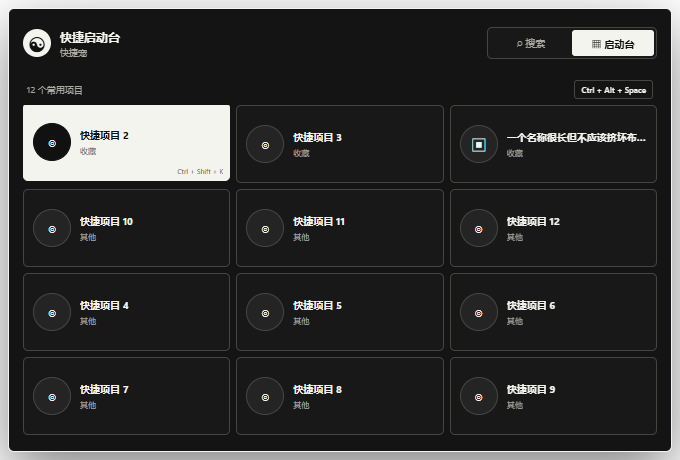

<div align="center">


# 快捷宠 QuickPet

**把快捷方式交给一只会走路的桌宠。**

面向 Windows 的桌宠式快捷收纳工具。集中管理网址、程序、文件和文件夹，自由分类，随用随开。

<p>
  
  
  
  
  <a href="https://github.com/YunsuStudio/QuickPet/actions/workflows/ci.yml"></a>
</p>

[下载便携版](../../releases/latest) · [使用说明](./使用说明.md) · [项目说明](./项目说明.md) · [报告问题](../../issues)

</div>


## 下载与运行

> **[前往 Releases 下载最新便携版](../../releases/latest)**

快捷宠只发布单文件便携版，不提供安装程序。

| 项目 | 说明 |
| --- | --- |
| 支持系统 | Windows 10 / 11 x64 |
| 当前文件 | `QuickPet-Portable-0.12.4-x64.exe` |
| 安装方式 | 无需安装，不自动创建快捷方式 |
| 首次运行 | 在 EXE 同目录创建 `QuickPet-Portable-Cache` |
| 数据位置 | 默认保存在本机，可备份和完整迁移 |

1. 把 EXE 放进可写的固定文件夹，例如 `D:\QuickPet`。
2. 双击运行，无需手动解压；桌宠与快捷面板会同时出现。
3. 按住桌宠本体即可拖动，单击桌宠打开快捷面板；把文件或链接拖到桌宠本体即可收纳。

当前 EXE 尚未进行商业代码签名，Windows 可能显示 SmartScreen 提示。请只从本仓库的 Releases 获取文件，并核对发布说明。

## 为什么是桌宠

| 快捷收纳 | 会活动的入口 |
| --- | --- |
| 收纳网址、程序、文件夹、图片、音视频、文档、压缩包、代码、设计文件、`.lnk/.url` 与 Steam 等协议。可拖入面板，也可直接“投喂”桌宠。 | 桌宠会散步、奔跑、观察、休息和睡觉；主面板打开后仍会继续活动。 |
| **不只靠鼠标**<br>使用全局搜索或快捷启动台，并可为全局入口和单个项目录制自定义组合键。 | **不限制外观**<br>使用 2D 图片、GIF、GLB、VRM 或 Live2D 模型，自定义大小、方向、动作和行为。 |
| **自动整理**<br>通过分类规则、剪贴板收纳、动态文件夹和提醒减少重复操作。 | **数据留在本机**<br>图片抠图、模型读取、快捷数据和备份都在本地处理，不依赖云端账户。 |

## 真实桌宠动作

<p align="center">
  
  <br>
  <sub>程序内置 3D 狐狸的实际渲染帧，不是概念动画。</sub>
</p>

内置狐狸带有骨骼动作。桌宠窗口只拦截模型附近的点击，透明区域不会大面积挡住右下角的其他程序。

## 界面实拍

| 模型与动作 | 自动化中心 |
| --- | --- |
|  |  |
| 保存多只模型，检查纹理、骨骼和动作，调整行为与跨屏范围。 | 管理分类规则、剪贴板、动态文件夹、提醒和多桌宠。 |

### 搜索与启动台

| 全局搜索 | 快捷启动台 |
| --- | --- |
|  |  |

默认按 `Alt + Space` 呼出搜索，按 `Ctrl + Alt + Space` 呼出快捷启动台，按 `Ctrl + Shift + Space` 打开主快捷面板。三个全局组合键都能在设置中直接录制修改，冲突时会立即提示并保留旧值。搜索在输入前保持为空；启动台只显示明确加入的项目，并可在启动台内直接移除。

## 模型与图片支持

| 格式 | 能力 | 注意事项 |
| --- | --- | --- |
| PNG / WebP / JPG | 本地自动识别主体并移除背景 | 结果不满意时可使用原图或重新抠图 |
| GIF | 保留原始逐帧动画 | 当前不自动抠图 |
| GLB / VRM | 模型体检、动作映射、尺寸和方向校正 | 旧版 GLB 白模材质会在导入副本中尝试转换 |
| Live2D | 动作、表情、物理、眨眼和视线跟随 | 需要完整的 `.model.json` 或 `.model3.json` 及引用文件 |

导入过程不会覆盖原模型。没有真实骨骼或对应动画的 3D 模型，程序无法凭空生成自然行走动作。用户自行导入的模型需要自行确认使用许可。

## 备份、迁移与便携缓存

- 每天自动创建本地备份，默认保留最近 10 份。
- 配置损坏时尝试恢复最近有效备份。
- 使用 `.quickpet` 文件迁移快捷项、分类、设置和自定义模型。
- 清理便携缓存时显示阶段、文件、百分比和已释放空间。
- 新版会隔离旧运行目录，并阻止同目录旧版继续读取新版数据。

更完整的升级、权限与缓存排障步骤见 [使用说明](./使用说明.md)。

## 开发

需要 Node.js 22.12 或更高版本。

```powershell
npm install
npm start
```

运行测试：

```powershell
npm test
```

构建 Windows x64 单文件便携版：

```powershell
npm run build
```

构建产物位于 `dist/QuickPet-Portable-0.12.4-x64.exe`。项目不会生成 NSIS、IExpress 或其他安装包。

## 测试状态

当前 121 项自动测试全部通过，覆盖无内置分类、多级分类、确认弹窗恢复、详细类型识别、手动排序、协议启动、搜索、启动台、组合键冲突回滚、桌宠投喂与拖动、透明区域点击、模型导入、备份恢复、便携缓存、发布构建兼容性和不同 DPI 双屏接缝等主要流程。

性能记录：CPU `0.68%`、峰值内存 `332.6 MB`、3D 空闲帧率 `30.08 FPS`。

## 开源与贡献

快捷宠自身源码采用 [MIT License](./LICENSE)。欢迎通过 [Issues](../../issues) 提交问题或功能建议。反馈问题时请附上 Windows 版本、桌宠模式与复现步骤。

Live2D Cubism Core、第三方依赖和内置狐狸模型不因项目采用 MIT 而改变原有许可。完整来源与署名见 [THIRD_PARTY_NOTICES.md](./THIRD_PARTY_NOTICES.md)。

## 文档

- [使用说明](./使用说明.md)：首次启动、快捷项、模型、自动化、迁移和常见问题。
- [项目说明](./项目说明.md)：架构、数据边界、性能策略、构建发布和已知限制。
- [第三方软件声明](./THIRD_PARTY_NOTICES.md)：依赖、Live2D Core 和内置模型的许可信息。

## 许可

开发者及版权所有者：**云间溯工作室**。

Copyright © 2026 云间溯工作室。项目自身源码采用 MIT License，第三方组件和素材遵循各自许可证。
