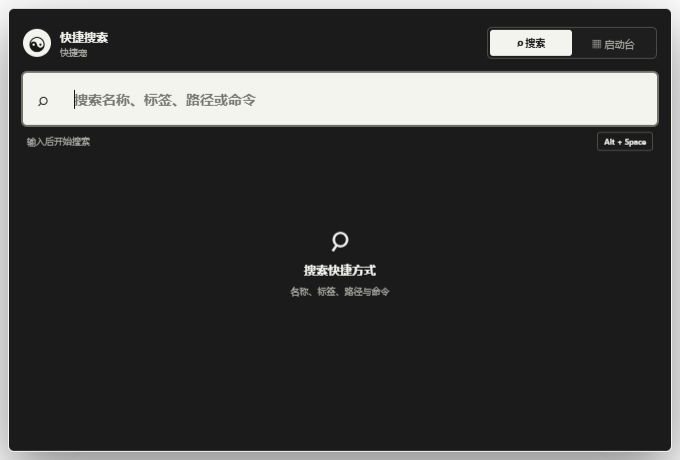
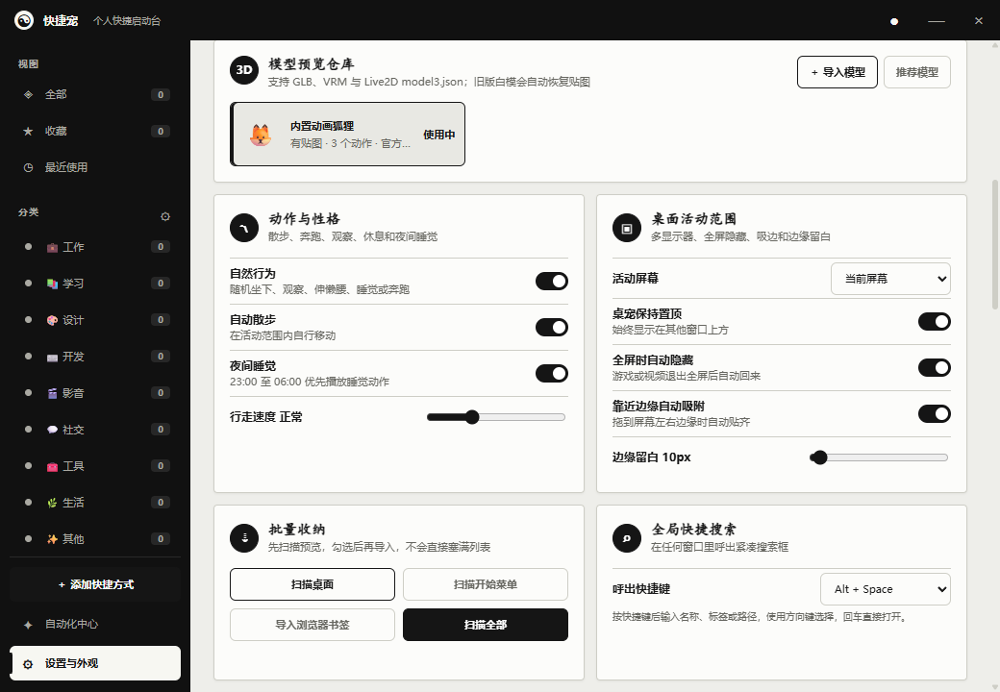
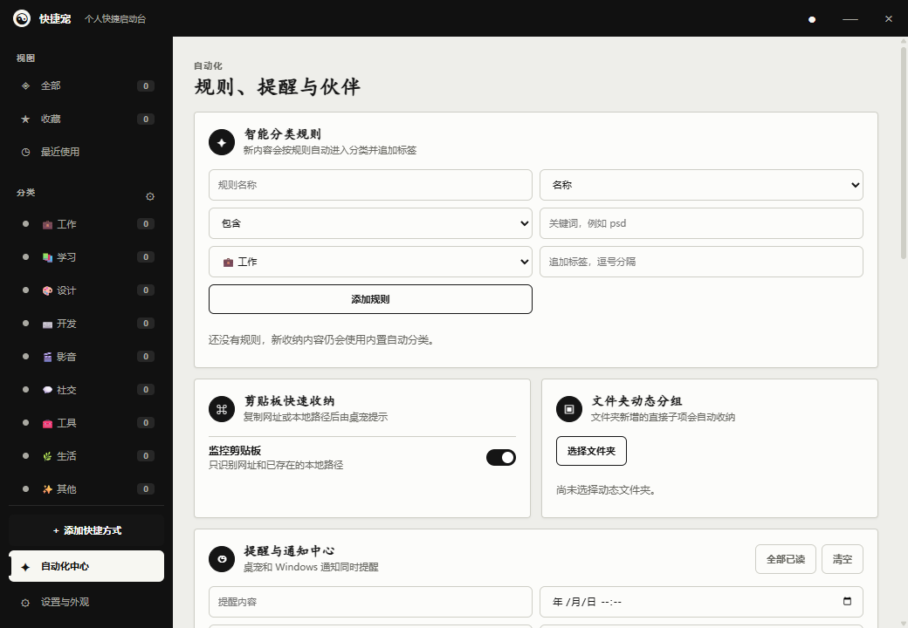

# 快捷宠使用说明

本手册适用于快捷宠 `0.11.19` Windows x64 便携版。

## 1. 首次启动

1. 将 `QuickPet-Portable-0.11.19-x64.exe` 放入可写的固定目录，建议不要放在压缩包、系统目录或只读位置。
2. 双击 EXE。首次启动会在同一目录创建 `QuickPet-Portable-Cache` 并准备运行文件。
3. 桌宠出现后，直接按住桌宠本体拖到合适位置。
4. 单击桌宠打开快捷面板。

快捷宠不会安装到系统，也不会自动创建桌面或开始菜单快捷方式。关闭快捷面板不等于退出程序；完全退出请右键桌宠，或在任务栏右下角的托盘菜单中选择“退出”。

如果 Windows 显示“未知发布者”或 SmartScreen，这是因为当前 EXE 尚未进行商业代码签名。只应运行从可信项目发布页获得的文件。

## 2. 添加和打开快捷项

快捷宠可收纳四类内容：

- 网址：输入完整网址，例如 `https://example.com`。
- 程序：选择 `.exe` 或 Windows 可打开的快捷方式。
- 文件：选择文档、图片、压缩包等本地文件。
- 文件夹：选择常用目录。

添加方式：

1. 打开快捷面板，点击“添加”。
2. 网址可直接输入；本地内容通过“浏览”选择。
3. 也可以把网址、程序、文件或文件夹直接拖入面板。
4. 确认名称、分类和图标后保存。
5. 单击快捷卡片即可使用系统默认方式打开。

设置页还可以扫描桌面、开始菜单、Chrome 和 Edge 书签。扫描结果会先显示预览，勾选后才会批量导入。

## 3. 分类、排序和查找

添加内容时，程序会根据名称、网址和文件类型建议分类。你可以继续修改分类、标签和收藏状态。

- 自动排序：按名称、类型、最近使用等规则排列。
- 手动排序：切换到“手动排序”后拖动卡片。
- 跨分类移动：把卡片拖到左侧分类名称上。
- 多级分类：在分类管理中选择上级分类。
- 收藏与最近使用：从侧栏快速过滤常用内容。

默认按 `Alt + Space` 呼出全局搜索。如果系统占用了这个组合键，程序会尝试改用 `Ctrl + Alt + Space`。

搜索框中输入项目名称、路径、标签或分类即可查找。输入 `>` 可查看设置、检查快捷方式、保存面板截图、清理缓存和检查更新等命令。

## 4. 为项目设置组合键

1. 编辑一个快捷项目。
2. 点击“快捷启动组合键”输入框。
3. 直接按下要使用的组合键。
4. 保存项目。

组合键至少需要一个 `Ctrl`、`Alt`、`Shift` 或 `Win` 修饰键。与全局搜索、系统热键或其他项目冲突时，程序不会注册，并会显示冲突状态。可在设置页的“快捷键台”集中查看和管理。

## 5. 移动和设置桌宠

- 拖动：按住桌宠模型本体移动，不需要额外拖动把手。
- 打开面板：短按桌宠后松开。
- 右键菜单：普通右键打开圆盘菜单；`Shift + 右键` 打开传统菜单。
- 自动散步：默认开启。打开面板或刚完成手动拖动时会暂时停下。
- 全屏隐藏：启用后，全屏程序运行时桌宠自动隐藏。
- 边缘吸附：靠近桌面外边缘时吸附，屏幕之间的接缝不会作为外边缘处理。

自动散步速度、活动范围、边缘留白、显示器范围和性能模式都可在设置中调整。

## 6. 2D 图片和自动抠图

支持 PNG、WebP、JPG 和 GIF 皮肤。

1. 打开“设置与外观”。
2. 选择 2D 自定义皮肤并上传图片。
3. PNG、WebP、JPG 会默认在本机自动识别主体并移除背景。
4. 结果不满意时，选择“使用原图”或“重新抠图”。

抠图过程完全在本机完成，图片不会上传。GIF 为了保留逐帧动画，当前使用原图，不执行自动抠图。主体与背景颜色过于接近、毛发边缘复杂或图片分辨率过低时，抠图效果可能需要换一张背景更干净的照片。

## 7. 3D、VRM 和 Live2D 模型

打开“设置与外观”中的模型预览仓库，可导入：

- `.glb`
- `.vrm`
- Live2D `.model.json` 或 `.model3.json`

导入前会预览并检查纹理、骨骼、动画和引用文件。GLB 旧版 `KHR_materials_pbrSpecularGlossiness` 材质会在导入副本中转换，尽量恢复内嵌颜色和贴图；原模型不会被覆盖。

每个 3D 模型都可以单独调整大小、旋转、朝向、上下位置和动作映射。可自动或手动映射 Idle、Walk、Run、Sit、Sleep、Stretch 等动作。没有对应动画的模型无法凭空生成真实动作。

Live2D 导入时应选择入口 JSON，并确保纹理、动作、表情、物理等引用文件都位于模型目录内。程序支持动作、表情、物理、眨眼和鼠标视线跟随。使用第三方模型前，请自行确认其个人使用和再分发许可。

若显卡或驱动不支持 WebGL，程序会回退到 2D 模式。模型体检显示 A-D 性能等级；高负载模型建议使用“无感”性能模式。

## 8. 自动化中心

从主面板左下方进入自动化中心。

可用功能包括：

- 智能分类规则：按名称、地址、扩展名等条件自动归类。
- 剪贴板收纳：复制网址或本地路径后，从桌宠提示中确认保存。
- 动态文件夹：把指定目录的内容动态呈现在面板中。
- 提醒：建立定时提醒、查看月历、完成或延后提醒。
- 多桌宠：建立额外桌宠并设置各自行为。

提醒月历右下角数字表示当天提醒数量。可按今天、明天、本周筛选，或将提醒延后 10 分钟。

## 9. 多显示器与性能

在显示器范围中选择桌宠可活动的屏幕。跨屏自动散步时，桌宠会把相邻显示器视为连续桌面，只在整个桌面的最外侧吸边。

不同显示器使用 100%、125% 等缩放比例时，Windows 坐标换算可能受显卡驱动和排列方式影响。若跨屏异常：

1. 在 Windows 显示设置中确认屏幕排列与实体位置一致。
2. 先把桌宠拖回主屏，再重新选择活动范围。
3. 暂时关闭边缘吸附进行对比。
4. 查看“诊断与日志”后重新启动程序。

性能模式建议：

- 无感：默认选项，空闲时降低帧率，交互和移动时临时提速。
- 平衡：动画更连续，资源占用适中。
- 高画质：优先动画流畅度，适合性能较好的电脑。

## 10. 数据、备份和迁移

快捷项目、分类和设置保存在本机，不会同步到云端。程序每天首次启动时自动备份，默认保留最近 10 份；配置损坏时会尝试恢复。

在设置中可以：

- 立即创建备份。
- 查看并恢复指定备份。
- 导出普通配置文件。
- 创建包含快捷项、分类、设置和自定义模型的完整 `.quickpet` 迁移包。
- 在另一台电脑上从文件恢复。

迁移前建议完全退出快捷宠，再复制或导入数据。完整迁移包可能包含本地路径和自定义模型，请像个人数据一样保管。

## 11. 便携缓存和更新

便携版第一次运行时，会在 EXE 同目录创建 `QuickPet-Portable-Cache`。它是程序的实际运行文件，不是每次都要手动解压的临时包。

升级步骤：

1. 完全退出当前快捷宠。
2. 把新版 EXE 放入原目录。
3. 启动新版 EXE。
4. 确认功能和数据正常后，再处理已被停用的旧 EXE。

新版启动器会识别同目录旧版，即使旧 EXE 被改名，也会根据产品标识进行保护。旧版会被改为 `.disabled`，避免继续打开新版本数据。

“存储与清理”会分别显示个人数据、模型、备份、当前运行文件、Electron 缓存和旧运行目录。点击清理后可看到当前阶段、文件、完成比例和已释放空间。清理时不要再次启动旧版 EXE。

旧缓存位于 C 盘且权限不足时，清理可能需要管理员权限。若系统文件仍被占用，请完全退出快捷宠后重试。启动或清理失败的日志优先写入 EXE 同目录的 `QuickPet-Portable.log`；目录不可写时使用 `%LOCALAPPDATA%\QuickPet`。

## 12. 常见问题

### 单击桌宠没有打开面板

拖动距离超过阈值时会被识别为拖动。短按桌宠且不要移动，松开后再观察。若桌宠正在跨屏移动，先等待它停下。

### 右下角其他程序无法点击

桌宠透明窗口的可点击范围会随模型调整。先移动桌宠或缩小模型；若仍有大片透明区域拦截点击，切换到 2D 模式并重新启动，用“诊断与日志”记录模型类型和问题位置。

### 自定义 GLB 是白色的

重新导入模型，让导入检查转换旧材质。若仍为白色，模型很可能没有嵌入纹理，或纹理引用文件未随模型提供。应在原建模工具中打包纹理后重新导出 GLB。

### 桌宠动画掉帧

切换到“无感”模式，降低模型尺寸或更换 A/B 性能等级模型。关闭多桌宠和不需要的 Live2D 物理效果也能降低占用。显卡驱动过旧时先更新驱动。

### 清理缓存没有变化

确认进度窗口是否显示“跳过”“权限不足”或“文件占用”。完全退出所有快捷宠进程后重新启动最新版再清理。旧缓存位于受保护目录时可能需要管理员权限。

### 关闭窗口后程序还在运行

这是正常行为。关闭面板只隐藏面板；使用桌宠右键菜单或系统托盘中的“退出”才能完全结束程序。

### 上次异常退出后变成 2D

程序自动进入了 2D 无感安全模式。确认自定义模型可正常加载后，在设置中选择“恢复原配置”。
