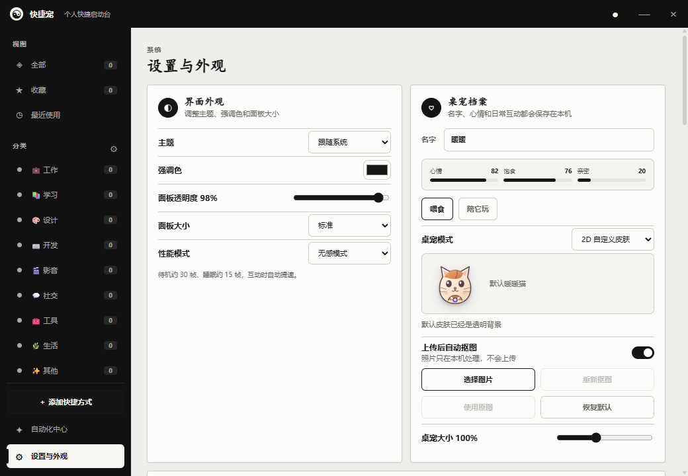
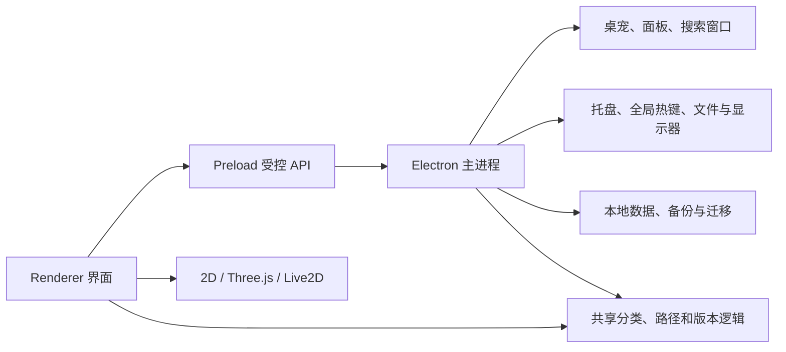
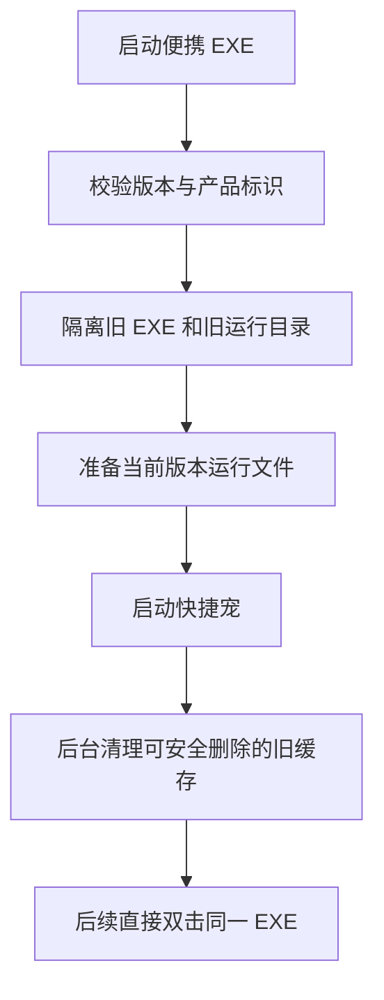

# 快捷宠项目说明

## 项目定位

快捷宠是一款 Windows 桌面快捷收纳工具。它用可移动、可自定义的桌宠作为入口，将网址、程序、文件和文件夹放进同一个可搜索、可分类的面板中。

产品面向希望减少桌面图标、又不想记复杂路径和启动命令的个人用户。当前版本只发布 Windows x64 单文件便携版，不提供安装程序。

## 当前版本

| 项目 | 状态 |
| --- | --- |
| 版本 | `0.11.18` |
| 平台 | Windows 10 / 11 x64 |
| 发布文件 | `QuickPet-Portable-0.11.18-x64.exe` |
| 自动测试 | 89 项通过 |
| 在线服务 | 无强制依赖，个人数据默认只保存在本机 |
| 自动更新 | 支持清单机制，但当前没有正式在线更新源 |
| 代码签名 | 当前未签名 |

## 功能范围

### 快捷收纳

- 添加网址、程序、文件和文件夹。
- 拖放导入与桌面、开始菜单、浏览器书签扫描。
- 自动分类、多级分类、标签、收藏、最近使用与手动排序。
- 全局搜索、维护命令和单项目全局组合键。
- 重复项目检测、路径可用性检查和本地使用统计。

### 桌宠

- 透明置顶窗口，直接按住模型拖动。
- 2D 图片、GIF、GLB、VRM 和 Live2D 模型。
- PNG、WebP、JPG 本地自动抠图。
- 3D 动作映射、自然行为、自动散步和跨屏活动。
- 多桌宠、心情与互动、全屏隐藏和边缘吸附。

### 自动化与数据

- 智能分类规则、剪贴板收纳和动态文件夹。
- 提醒月历、完成与延后。
- 每日备份、配置损坏恢复和完整换机迁移。
- 存储统计、便携缓存清理、旧版本隔离和诊断日志。

## 界面设计

界面使用太极墨白方向：低饱和黑、白和中性灰构成主层级，功能状态使用克制的分类色。桌宠是入口，收纳面板保持紧凑，以快速扫描和反复操作为主。



文档中的截图和动画均由真实程序测试模式生成，不使用虚构界面稿。

## 技术架构

项目基于 Electron。主进程负责系统能力和窗口生命周期，Preload 只暴露受控接口，Renderer 负责交互与模型渲染，共享模块保存可测试的纯逻辑。



主要目录职责：

- `src/main`：窗口、IPC、托盘、快捷键、文件访问、缓存与便携生命周期。
- `src/preload`：隔离页面与主进程，提供明确的 IPC 桥接接口。
- `src/renderer`：主面板、设置、搜索、自动化和桌宠渲染。
- `src/shared`：主进程与测试可复用的业务规则。
- `assets`：应用图标、内置模型和发布资源。
- `scripts`：渲染器打包、便携启动器、图标和发布校验。
- `tests`：Node 自动测试和隔离 UI 验收入口。

## 便携版运行方式

便携 EXE 本身是启动入口。首次运行时，它在同目录创建 `QuickPet-Portable-Cache`，把匹配当前版本的运行文件准备到独立目录，再启动 Electron 应用。



启动器不会让旧版继续读取新版数据。同目录识别到旧版后，会将旧 EXE 改为可恢复的 `.disabled` 文件；清理失败时会写入诊断日志。

## 数据与隐私

- 快捷项、分类、设置、统计和提醒默认保存在本机。
- 自动抠图在本机执行，不上传用户照片。
- 模型文件在本地读取和保存。
- 每天首次启动自动创建备份，默认保留最近 10 份。
- `.quickpet` 完整迁移包可包含快捷路径、设置与自定义模型，应妥善保管。
- 程序不会替用户取得第三方模型授权，导入者需确认模型许可。

普通开发模式使用 Electron 用户数据目录。便携发布模式还会在 EXE 同目录维护 `QuickPet-Portable-Cache`。实际位置和占用可在“存储与清理”中查看。

## 安全边界

- Renderer 不直接获得完整 Node.js 权限，通过 Preload 白名单调用系统功能。
- 外部网址、路径和导入文件在主进程中进行类型、大小和位置校验。
- GLB、Live2D 和迁移包采用受限导入流程，避免覆盖原文件。
- 更新包支持 SHA-256 校验，但只有配置可信更新清单后才应启用。
- 当前 EXE 未进行商业代码签名，发布时应同时提供哈希值和明确来源。

## 性能策略

桌宠属于常驻程序，默认“无感”模式将空闲帧率降到较低水平，只在移动和交互期间提速。实现还包括：

- 缩略图和模型资源独立缓存，减少状态文件体积与 IPC 传输。
- 桌宠移动合并更新，避免每帧重复写盘。
- 3D 资源在模式切换和窗口关闭时主动释放。
- 全屏检测、边缘吸附和自动抠图使用节流或后台任务。
- 模型导入提供 A-D 性能等级，提前提示顶点、材质和纹理负担。
- 异常退出后进入 2D 安全模式，避免有问题的模型反复导致启动失败。

最近一次验收记录为 CPU `0.77%`、峰值内存 `362.8 MB`、3D 空闲 `30.07 FPS`。这些数据用于回归对比，不是所有电脑上的性能承诺。

## 测试与质量状态

当前 `npm test` 共 89 项，覆盖：

- 分类、排序、快捷键和路径规则。
- 数据保存、备份恢复和迁移。
- 便携版本识别、旧缓存清理与权限失败处理。
- 3D 材质转换、模型检查和渲染资源释放。
- 桌宠拖动、点击穿透、吸边和不同缩放比例双屏坐标。
- 主面板、设置、搜索和自动化隔离 UI 流程。

发布前仍需在真实设备验证三屏或异形排列、旋转屏、睡眠唤醒、不同显卡驱动、SmartScreen，以及用户自有 Live2D 模型。

## 开发与构建

环境要求：Node.js 20 或更高版本，Windows PowerShell。

```powershell
npm install
npm start
```

测试：

```powershell
npm test
```

构建：

```powershell
npm run build
```

构建流程会先打包 3D 和 Live2D Renderer，生成 Electron 解包目录并验证启动，最后创建 `dist/QuickPet-Portable-0.11.18-x64.exe`。项目不生成 NSIS、IExpress 或其他安装包。

## 发布检查表

1. 确认 `package.json` 版本号和文档一致。
2. 执行 `npm test` 并确认全部通过。
3. 执行 `npm run build`。
4. 在无开发环境的 Windows x64 电脑上首次启动便携版。
5. 验证 EXE 同目录缓存、升级、旧版隔离和退出后清理。
6. 验证 2D、内置 3D 狐狸、搜索、组合键、备份和恢复。
7. 生成并发布 EXE 的 SHA-256。
8. 检查 `THIRD_PARTY_NOTICES.md` 随应用一起打包。

## 日志与排障

便携启动或旧版处理失败时，日志优先写入 EXE 同目录的 `QuickPet-Portable.log`。目录不可写时回退到 `%LOCALAPPDATA%\QuickPet`。

出现问题时应记录：应用版本、Windows 版本、显示器排列和缩放、宠物模式、模型类型、复现步骤及日志。详细用户排障步骤见 [使用说明](./使用说明.md)。

## 已知限制

- 只支持 Windows x64 便携发布。
- GIF 暂不自动抠图。
- 没有正式在线更新源和商业代码签名。
- 用户模型的动画、纹理完整性和许可无法由程序完全保证。
- 特殊多显示器布局与显卡驱动组合仍依赖真实硬件验收。

## 第三方组件

项目使用 Electron、Three.js、PixiJS、OpenCV.js 和 Live2D 相关运行时，并内置 Khronos glTF 示例狐狸模型。完整许可与署名见 [THIRD_PARTY_NOTICES.md](./THIRD_PARTY_NOTICES.md)。
